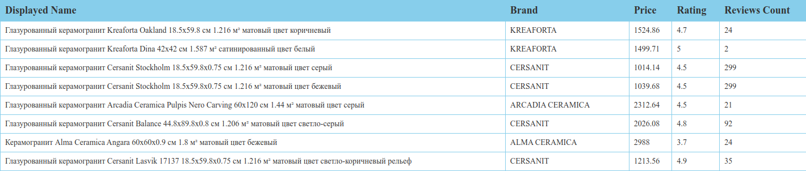

## ⚙️ Использованные для анализа технологии: 
- Burp Suite Community Edition
- PostMan
- Iphone 12 
- Приложение Lemana Pro

## 💼 Настройка Burp Suite: 
1. Заходим в таб Proxy -> Proxy Settings 
2. Устанавливаем новый Proxy Listener, выставив конкретный адрес (локальный IP вашего компьютера в Wi-Fi сети) и некоторый незанятый порт (пусть 8080)
3. Все, слушатель настроен

## 📱 Мобильное устройство:
1. Надо настроить проксирование через компьютер, перейдите в Wi-Fi, выберите сеть к которой подключен компьютер с Burp Suite, подключитесь к ней и перейдите в Configure Proxy, поставьте ручную установку Manual и вставьте локальный IP вашего компьютера с портом в пустые поля
2. После установки проксирования запросов зайдите в любой браузер на страницу http://burpsuite, там будет кнопка CA Certificate, нажмите на нее и установите сертификат через настройки (не забудьте добавить его в доверенные сертификаты)
3. Все, теперь Burp Suite на компьютере может видеть все запросы и их содержимое, которые отправляются с телефона (не забудьте поставить intercept on в Burp Suite)

Сетап для прослушивания запросов окончен

## 🔍 Анализ эндпоинтов

Заходим в приложение Lemana Pro и смотрим исходящие запросы, нас интересует домен mobile.api-lmn.ru, он отвечает за работу с контентом приложения

Необъодимые нам эндпоинты это:
 - `https://mobile.api-lmn.ru/mobile/v2/search` - Получение товаров некоторой категории
 - `https://mobile.api-lmn.ru/mobile/pdp/main?sku={option1}&regionId={option2}` - Получение информации о конкретном товаре в некотором регионе
 
Все потенциально чувствительные данные отсюда убраны, здесь только форма запросов, конкретику можете увидеть у себя

### Для поиска нам нужны следующие данные:
1. Заголовки запроса
```http
Host: mobile.api-lmn.ru
Ab-Test-Option: opt1
Apikey: 0000 // по сути главный заголовок, он обязателен
User-Agent: ktor-client
Mobile-Platform: ios
User_id: 0000
Plp-Srp-View: mixed
App_version: 0000
Mobile-Version: 0000
Pdp-Content-Ab-Option: all
Content-Length: 0000
Mobile-Version-Os: 0000
Timestamp: 0000
Accept-Language: ru
X-Firebase-Instanceid: 0000
Hash: 0000
Accept-Charset: UTF-8
Accept: application/json
Content-Type: application/json; charset=UTF-8
Accept-Encoding: gzip, deflate, br
Mobile-Build: 0000
```
2. Тело запроса в JSON формате
```json
{
"familyId":"",
"limitCount":30, // сколько элементов показать (пагинация)
"limitFrom":0, // сколько элементов пропустить с начала (пагинация)
"regionsId":0000, // id региона
"firebasePseudoId":"NONE",
"availability":true,
"showProducts":true,
"showFacets":true,
"showServices":true,
"sitePath":"/catalogue/keramogranit/" // что смотрим
}
```

### Для получения данных о конкретном товаре нам также нужны:
1. Заголовки
```http
Host: mobile.api-lmn.ru
Accept: application/json
Accept-Charset: UTF-8
Pdp-Content-Ab-Option: all
App_version: 0000
Mobile-Version-Os: 0000
Accept-Language: ru
Accept-Encoding: gzip, deflate, br
Mobile-Platform: ios
Apikey: 0000 // по сути главный заголовок, он обязателен
Mobile-Version: 0000
Mobile-Build: 0000
User-Agent: ktor-client
Content-Length: 0
```
2. Параметры запроса
	1. `sku={int}` — артикул товара
	2. `regionId={int}` — Id региона, очевидно

На этом все, дальше можете автоматизировать парсинг
Ниже результат запроса, проведенного через PostMan и визуализированного там же:



> P.S. У меня запросы перестали отклоняться фильтрацией после включения VPN на ПК